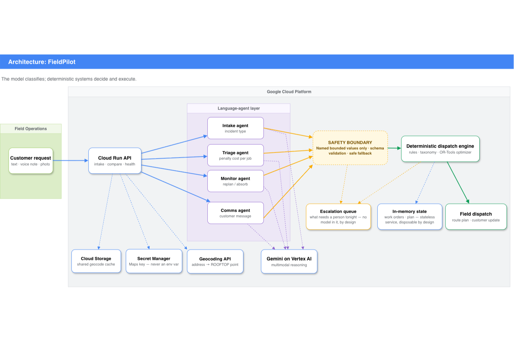

# FieldPilot

**An autonomous dispatch agent for field service teams.**
Built for the All Things Agentic Hackathon — track: **The Taskmaster**.

---

## Why this exists

I have spent years implementing Dynamics 365 Field Service for clients. The
scheduling engine works. Resource Scheduling Optimization does exactly what it
says: it respects skills, territories, time windows and priorities, and it
returns a mathematically sound plan.

And every single day, dispatchers override it by hand.

Not because the optimiser is wrong. Because the optimiser is answering a
question that was already settled by the time it ran. Someone decided which
jobs matter, how long they will really take, and what to do when the morning
falls apart — and that someone was a person with a phone, reading a WhatsApp
voice note from a building manager and deciding it sounded serious.

FieldPilot is an attempt to automate *that* part.

## The idea in one line

> The language model does not build the route. The language model writes the
> cost function that the solver optimises.

Everything follows from that split:

- **Judgement is a model problem.** Reading a voice note, looking at a photo of
  a leaking boiler, weighing a platinum SLA against a customer who has already
  been bumped twice — none of this is expressible as a constraint, and all of
  it is what actually determines who gets seen first.
- **Routing is a solver problem.** Once the costs exist, arranging visits is
  operations research with fifty years of theory behind it. There is no reason
  to ask a language model to do arithmetic it will do worse.

Triage emits a `penalty_cost` per work order. The solver minimises travel plus
the penalties of whatever it could not fit. That single integer is the whole
interface between the two halves.

## Architecture



Every place a model output crosses into the deterministic side is one named,
bounded value with a deterministic fallback, and every override of a model
opinion is logged on the work order. The diagram marks that boundary
explicitly, because it is the design — not the components on either side of
it.

## What the system does

| Component | Responsibility |
|---|---|
| **Intake** | Turns raw requests — text, voice notes, photos — into structured work orders with skills, durations, time windows and geocoded addresses. |
| **Triage** | Scores real urgency from SLA tier, waiting time, reschedule history and severity. Writes `penalty_cost` and a human-readable rationale. |
| **Plan engine** | OR-Tools VRPTW with time windows, certifications and drop penalties. Deterministic, no model in the loop. |
| **Disruption monitor** | Runs in the background. Decides whether a delay is worth re-planning for or should be absorbed. |
| **Comms** | Notifies affected customers; every draft is verified against computed facts before it can go out. |
| **Escalation queue** | Model-free. Collects what must reach a person before tomorrow, ordered by consequence. |
| **Duration memory** | Learns real service durations per technician from completed visits. Measured against its own oracle ceiling — and the honest verdict below is that it buys almost nothing here. |

## Current status

Feature-frozen for judging. What is implemented and tested:

- Complete domain model in Field Service vocabulary
- OR-Tools solver with certifications, time windows, per-technician pace and
  drop penalties — solution-limited so results reproduce across machines
- A baseline dispatcher to measure against, and a hidden-ground-truth harness
  with oracle ceilings for everything that claims a number
- Reproducible scenario generator and a simulated day with an accelerated
  clock: overruns, absent customers, missing parts, inbound emergencies,
  cancellations and a technician breaking down
- Gemini triage through ADK, with a rules engine as both fallback and control
- A disruption monitor that decides, through the day, whether a broken plan is
  worth re-planning or should be absorbed — with mid-day re-planning from
  wherever the crew actually is
- Multimodal intake — typed message, voice note, photograph — from the CLI and
  over HTTP, with honest escalation when the input is too ambiguous
- Customer comms with computed facts, a verifier that refuses commitment
  language, and a template floor that always exists
- A model-free escalation queue for what must reach a person before tomorrow
- Per-technician duration memory, measured to a null result that is reported
  as one
- Deployed on Cloud Run with a self-verifying deploy script, the two paid
  endpoints behind an API key; geocode cache shared across instances through
  Cloud Storage
- 253 tests covering scheduling, execution, triage, monitoring, intake, comms,
  escalation, the API and experiment integrity

## The demo, as one command

```bash
fieldpilot demo --pace 0.8          # the take: real Gemini calls end to end
fieldpilot demo --offline           # the rehearsal: same run, no model, no cost
```

Seven acts in one unbroken execution: a customer message read by Gemini and
ruled on by the taxonomy, the morning backlog scored in one triage call, the
OR-Tools plan against the naive baseline, the day's disruptions and re-plans as
they happen, the customer messages drafted and verified, the escalation queue,
and the scorecard with the model spend for everything just watched.

Nothing in it is demo-only code — every act calls the same modules as the
ordinary commands, `--pace` only inserts reading pauses, and the plan is
solution-limited so the take shows exactly what the rehearsals showed. Rehearse
offline for free as many times as it needs; film the online run once.

## Multimodal intake, from the browser

`POST /intake/multimodal` takes what a customer actually sends: a typed
message, a photo of the equipment, a voice note — any combination. The Swagger
page at `/docs` renders it as a form with file pickers, so a reviewer can send
a real photo and voice note from the browser with no tooling at all — click
*Authorize*, paste the intake key from the submission's testing instructions,
and use the form. The voice
note is transcribed verbatim into `customer_words`; the photo can change the
classification, and whether it *did* is exactly what the repeated ablation in
this README measures. Uploads are allowlisted by content type and size-capped,
spooled to a temp file, and deleted before the response returns — the endpoint
never grows behaviour the CLI does not have.

## Deployed on Cloud Run

Live deployment: **https://fieldpilot-455532283429.us-central1.run.app** —
`/docs` renders the multimodal intake form in the browser;
`/compare?seed=42&orders=20` runs both planners offline and costs nothing to
poke. The first hit after idle takes ~10 s (cold start); everything after is
instant.

`/health`, `/compare` and `/docs` are open to anyone. The two endpoints that
spend money — `POST /intake` and `POST /intake/multimodal`, one Gemini call
each — ask for an `X-API-Key` header. Judges have the key in the submission's
private testing instructions (Devpost shows that field to judges only) and
`/docs` takes it through the *Authorize* button; anyone else gets a 401 and
can run their own copy with the script below.

```bash
./scripts/deploy_cloud_run.sh <PROJECT_ID>
```

One script builds the container with Cloud Build, deploys it, and then proves
the deploy from outside with four checks: `/health` (configuration, secrets
reported as present or absent — not `/healthz`, which Cloud Run's frontend
reserves and 404s before it reaches the container), `/compare` (both planners
on the same day — offline and reproducible, so it costs nothing to poke),
`/intake` without the key (must be 401 — if it is not, the script takes the
public door away again and fails, because a deploy that leaves a paid endpoint
open is worse than no deploy), and `/intake` with the key (one real customer
message through Gemini on Vertex AI, returning what the model said and what
will actually be dispatched as separate objects, overrides listed).

The service runs as a dedicated service account that can call Vertex AI, read
two secrets, and write one bucket — nothing else. Both keys travel through
Secret Manager, never through `--set-env-vars`; the intake key is generated
once and kept across deploys, so the value in the submission keeps working.
Instances are capped at two, concurrency at eight and requests at sixty
seconds, because this runs on a credit budget: the key decides who may spend,
these decide how fast anyone can even if it leaks, and Cloud Run enforces all
three outside the container, where no application bug can lift them.

The service itself is stateless by design — it scales to zero and back, and
no instance holds anything another instance needs. The one thing that earned
persistence is the geocode cache: it costs real money to rebuild, so it is
shared across instances and deploys through a Cloud Storage bucket the deploy
script creates (last-writer-wins, merged on first read, and the service runs
identically if the bucket is absent). The duration memory earned none — an
empty one returns factor 1.0, and the measurement below says persisting it
would preserve something worth +3.6 ±5.2 points, which is to say nothing.

## Try it

```bash
pip install -e ".[dev]"
cp .env.example .env      # then fill in your project
fieldpilot --config       # confirm what it picked up
fieldpilot compare --seed 42 --routes --solution-limit 30
```

`fieldpilot --config` prints which `.env` was read, the project, region and
model, and whether a Maps key was found — and whether that key came from the
file or from the shell, because the two go wrong in different ways. The value
itself is never printed. It exists because the alternative failed silently:
without a key the geocoder falls back to an offline stand-in that prints
plausible Buenos Aires coordinates, and nothing on screen said so.

No API key and no cloud account required for this command: travel times fall
back to an offline estimator so the scenario can be run as many times as you
like at zero cost.

### Planning: optimiser vs baseline

```
Scenario seed 42 — 26 work orders, 4 technicians
------------------------------------------------------------------------------
fifo-nearest   served 18/26 (69%)  weighted 62%  travel 338min  true value  88.3%  safety missed 0
ortools        served 20/26 (77%)  weighted 81%  travel 367min  true value  98.7%  safety missed 0
------------------------------------------------------------------------------
orders served       +2
travel per job      18.8 -> 18.4 min (+2%)
total travel        338 -> 367 min (higher because more jobs get done)
weighted coverage   +19.1 pts
safety jobs missed  0 -> 0
```

Seed 42 is one scenario and it is a mild one: the baseline already serves 69%
of it and misses no safety call, so the room the optimiser has to win is small.
That is the honest reason to look at `watch --seeds N` below rather than at
this block — a single easy day flatters the baseline exactly as a single hard
day would flatter the optimiser.

**Why `--solution-limit`.** OR-Tools stops on a wall clock by default, so the
same inputs on a loaded machine explore fewer nodes and return a different plan.
That is not hypothetical: it made the simulator's determinism test pass alone and
fail inside the full suite. Counting improving solutions instead is
machine-independent — and about thirty times faster here, which took the test
suite from three minutes to one. Any plan solved against the clock is flagged
`reproducible=False` and the command says so, because a number nobody else can
reproduce should not be quoted without that caveat.

### Execution: what the day does to a good plan

```bash
fieldpilot run --seed 42
```

```
08:39 ! customer_absent      nobody home at wo-012; Diego Rossi leaving
09:36 ! job_overrunning      Ana Pereyra is running ~62 min over on wo-020
09:52 ! urgent_order_arrived Emergency caller 2 (platinum) reports boiler-no-heat
09:57 ! urgent_order_arrived Emergency caller 1 (platinum) reports gas-smell
12:23 ! resource_unavailable Ana Pereyra is out for the rest of the day (van breakdown)
14:37 ! window_missed        Carla Nunez can no longer reach wo-004 inside its window
...
static plan   done 12  failed 3  missed-window 2  never-tried 10  weighted 41.7%  safety 0/2  late 174min
```

The 8am plan covered 81% of the backlog. Executed blindly, with nobody
reacting, it finished 12 jobs and **both emergencies went unserved**. That gap
between a good plan and a survived day is the thing this project is actually
about — and it is the control condition the disruption monitor is measured
against.

### What the model is reliable at, measured

```bash
fieldpilot intake --text "..." --image foto.jpeg --audio nota.m4a --ablate --repeat 10
```

A single with-photo/without-photo comparison cannot separate "the photo changed
the answer" from "the model gave a different answer". Both look the same: two
outputs that differ. Two single-trial ablations on one identical request gave
opposite conclusions here — first that the photo changed nothing, then that it
changed three fields, one of which was the customer's time window, which no
photograph of an air conditioner can carry.

So the ablation runs the pair N times and prints the paired change rate beside
the model's disagreement with **itself** on unchanged input. Ten trials on one
request, text plus voice note plus photo:

```
  field         photo changed it   model changed its own mind   verdict
  type                  0/10                       0/9        not moved by the photo
  severity              1/10                       1/9        indistinguishable from noise
  skills                5/10                       5/9        indistinguishable from noise
  duration              2/10                       3/9        indistinguishable from noise
  window                2/10                       2/9        indistinguishable from noise
  escalation            0/10                       0/9        not moved by the photo
```

**Nothing clears the bar. On this request the photograph does not measurably
change the work order, and it costs about 30% more per call.** That is a
negative result and it is reported as one. It does not generalise to requests
where the text is thin — an earlier run on a vaguer message did move severity
and the required trade — but the claim "multimodal helps" is not supported
here, and this repository does not make it.

**Two corrections are recorded in this section rather than quietly fixed.**
The first verdict rule compared the two counts directly, which promoted a 2/5
against 1/4 — a one-run difference — to a finding; it now requires ten trials
and a forty-point margin. And on five trials severity appeared to change on
four of four comparisons, which was written up as the headline result. At ten
trials it changed on one of nine. **That finding did not replicate.** It was
small-sample noise read as signal, made while building the tool whose purpose
is to prevent exactly that.

**What did replicate is skills**, at 3/4 and then 5/9: the model will not settle
on whether a split that fails to heat needs `hvac` or `hvac`+`elec`. That is not
cosmetic. Three of the four technicians hold `hvac`; one holds `hvac`+`elec`. A
coin flip on that field is a coin flip between a job three people can take and a
job only Bruno can take.

So the model classifies and the taxonomy owns the consequences of the class:

| | decided by | why |
|---|---|---|
| incident type | the model | needs language, and it was identical on all 10 |
| severity | the incident taxonomy | sets `penalty_cost`; the type exists to fix it |
| required skills | the incident taxonomy | decides who can go; the model wobbles |
| address, window, the customer's own words | the model | nothing else can read them |

The model can still raise severity above the default — a maintenance call that
mentions a burning smell is a safety call and no lookup table knows that — but
it cannot lower it. If a photograph genuinely changes the trade required, the
honest way to say so is a different incident type, which the model can still
choose. Every override is recorded on the work order and marked `*` on the
summary line.

The report closes by making the same self-comparison on the work order that
would actually be dispatched, which is the number that matters:

```
  Same 9 comparisons, made on the work order that would actually be dispatched:
    type 0/9, severity 0/9, skills 0/9, duration 3/9, window 2/9, escalation 0/9
  Absorbed by the taxonomy before reaching a van: severity, skills
```

The model is still unstable. The dispatch is not. That is the whole architecture
in one table, and it is the reason this project does not ask a language model
to emit a plan.

### Telling the customer, without letting the model promise anything

```bash
fieldpilot comms --seed 42 --orders 40 --solution-limit 30
fieldpilot comms --seed 42 --orders 40 --solution-limit 30 --templates-only
```

When a plan changes, somebody is waiting at home for a van that is no longer
coming at eleven. Writing that message well is a language job. Writing it
*wrongly* is a liability: "we'll be there within the hour", "there will be no
charge for this visit", a phone number the model invented. Those are commitments
made on the company's behalf by something with no authority to make them.

So the same split as everywhere else in this project, applied to words:

- **The facts are computed, never generated.** A `Notification` carries the new
  arrival time, the technician, the reason and the options, all derived from the
  plan and the simulator.
- **The draft is checked before it is sent.** Every number in the message must
  appear in the facts. Commitment language is refused outright, in English and
  Spanish, because the model will write either.
- **The template is written first and always exists.** It is not a fallback
  bolted on afterwards — it is the floor, and the model's job is to beat it. A
  rejected draft is discarded rather than patched, because a repaired message is
  one nobody has read in its final form. `--templates-only` runs the whole path
  with no model calls at all.

The number worth watching is not the prose, it is the rejection count and its
reasons. That is the earliest signal that the prompt, the model, or the facts
being fed to it have drifted — and because the template goes out instead,
nothing wrong ever reaches a customer while it is happening.

### What has to reach a person before tomorrow

Every automated dispatcher ends the day with a residue: work it could not place,
addresses it guessed at, decisions it should not have made alone. The dangerous
version of this system is the one that ends its day silently.

The escalation queue is deliberately model-free. A queue a model can talk itself
out of raising is not a safety net, and its entire job is to catch what
everything upstream — the model included — got wrong. Three levels, ordered by
consequence rather than tidiness:

| | means |
|---|---|
| `blocking` | somebody could be hurt: an unserved safety call, an address that geocoded outside the service area or came from the offline stand-in |
| `same_day` | a customer is owed a call from a person: waiting a week, rescheduled twice, two failed visits, or an intake the system refused to dispatch on |
| `review` | defensible, but a person should see it — a pattern of defensible decisions is how a bad one hides |

An ordinary dropped job is not an escalation. A day that fits everything was
overstaffed, and a queue that flags every deferral is a queue nobody reads.

### Memory: what it learned, and what that turned out to be worth

```bash
fieldpilot memory --seeds 6 --days 12 --solution-limit 30
```

**First, a cheat had to come out.** Until this point the solver read
`BookableResource.duration_factor` — the simulator's ground truth for how fast
each technician works — directly off the scenario. No dispatcher has that
number. The planner was being handed the answer and scoring itself on it. It
now starts from the nominal estimate for everybody, and has to earn any
correction by watching completed visits.

The duration memory learns the ratio of actual to estimated duration per technician
and incident type, shrunk toward 1.0 by a prior worth six visits, clamped, and
learned only from visits that actually completed — a job that ended because
nobody was home says nothing about how long the work takes. After fifteen
simulated days:

| technician | true speed | learned | observations |
|---|---|---|---|
| Carla Nuñez | 0.95 | 1.13 | 24 |
| Ana Pereyra | 1.00 | 1.19 | 49 |
| Diego Rossi | 1.05 | 1.27 | 51 |
| Bruno Diaz | 1.15 | 1.36 | 68 |

The ordering is exactly right and the spread is right. Every value is inflated
by about the same fifth, because overruns and interruptions lift every visit
rather than particular people. That is the memory working, not failing.

**And it bought almost nothing.** Twelve consecutive days, six seeds, paired
against the same days with no memory:

| arm | paired vs no memory | spread | better on |
|---|---|---|---|
| learned memory | +3.6 pts | ±5.2 | 4/6 seeds |
| **oracle — handed the true speeds** | **+3.0 pts** | **±6.0** | **4/6 seeds** |

Read the oracle row first. **Perfect knowledge of every technician's true speed
is worth +3.0 points with a spread of ±6.0** — that is, it is not measurably
worth anything. So there was never much on the table, the learned row is
indistinguishable from the ceiling above it, and the honest conclusion is not
"memory works" but *per-technician speed is not where the value is in this
scenario, and here is the experiment that says so.*

Splitting the correction into a fleet-wide part and a per-technician part
(`DurationMemory(relative=True)`) was tried on the theory that the common
inflation was doing the damage. It scored +2.4 ±5.2 on 3/6 — no better. That
theory is not supported either.

Three separate runs at 5, 12 and 15 days gave +0.8, +3.6 and +1.6, every one of
them inside its own spread, and a day-by-day breakdown showed no trend with
accumulated evidence. The feature stays because removing the oracle was
necessary and memory recovers what it can. The claim does not.

### Isolating what the model contributes

```bash
fieldpilot triage --seed 42 --routes
```

Four ways of deciding what matters, on one backlog, one solver, one set of
travel times:

| | reads structured fields | reads the notes |
|---|---|---|
| **rules** | yes | no |
| **keywords** | yes | by term matching |
| **gemini** | yes | as prose |
| **oracle** | — | scored from hidden ground truth |

The oracle is not a competitor. It is the ceiling: without it we would know one
method beat another but not whether the gap left on the table was trivial or
enormous.

**Why the notes exist.** Structured fields — severity, SLA tier, days waiting,
reschedule count — are exactly what a rules engine is good at, and an earlier
version of this comparison showed the model and the rules engine scoring
identically, because both were reading the same digested facts. The free-text
note is where the deciding information actually lives in a real work order, and
it is the one field a rules engine structurally cannot use.

**How the experiment is kept honest.** Notes describe situations, never
priorities. Roughly a third point *downwards* — the flat is empty, they
borrowed a heater — so blindly inflating on any text loses to ignoring text.
Some are pure logistics with no urgency at all. And every situation has several
phrasings: an earlier single-wording version let a keyword scanner recover 77%
of the signal, which turned out to be an artifact of the same author writing
both the notes and the keyword list. With realistic paraphrase, that fell to
39%.

**The honest caveat.** Ground truth is authored alongside the notes, so this
measures whether a method recovers signal encoded in prose. That is a real and
necessary capability. It is not by itself proof of value in a live deployment.

If the model call fails for any reason, every unscored order falls back to the
rules engine and the run reports how many. A dispatch system that stops working
because an API timed out is worse than one that degrades and says so.

### Watching the day: triage quality x monitoring

```bash
fieldpilot watch --seed 42 --orders 48 --seeds 6
```

The first version of this compared *watched* against *unwatched* and found the
monitor made things **worse** — 73% of true value down to 68%. That looked like
a failed component. It was not.

The cause was that re-planning used penalties written by the rules engine,
which cannot read the notes. One re-plan traded a job worth 59,945 of true
value for three worth 35,776 combined, and it was right to by its own lights:
the note that made the first job matter was invisible to it. **Four re-plans
applied poor judgement four times instead of once.**

So the real experiment is a 2x2. The final measurement: **18 seeds, 48 orders
per day**, run after every correction this document records — severity and
skills owned by the taxonomy, the true-speed oracle removed from the solver,
`split-no-heat` in the taxonomy, and solution-limited (reproducible) solving.
An earlier 6-seed table stood here; it went stale when the taxonomy changed
and was replaced, not averaged in.

| 18 seeds, 48 orders | true value | paired vs baseline | lateness | emergencies |
|---|---|---|---|---|
| rules triage, unwatched | 43.0% ±20.6 | — | 368 min | 16/42 |
| rules triage, watched | 54.8% ±23.8 | +11.7 ±27.7, better on 14/18 | 45 min | 30/42 |
| gemini triage, unwatched | 45.6% ±17.6 | +2.6 ±18.7, better on 11/18 | 320 min | 18/42 |
| **gemini triage, watched** | **57.6% ±22.2** | **+14.6 ±25.8, better on 16/18** | **30 min** | **34/42** |

**How to read it.** The means are noisy — the spreads are bigger than the
effects, because a simulated day is a violent thing. The trustworthy statistic
is sign-consistency: the full system beats its own seed's baseline on **16 of
18 days** (a coin would do that less than one time in a thousand), and
monitoring alone wins on 14 of 18. Gemini triage *alone* — 11 of 18 — is not
supported as a standalone claim, and this document does not make it.

**What the factors decompose into.** Monitoring is the heavy lifter (+11.7 of
the +14.6). Gemini triage contributes about +3 more, but only in combination
with the monitor — which is the earlier finding again, from the other side:
re-planning is where triage judgement gets applied repeatedly, so that is
where reading the notes pays. The non-additive interaction is **+0.3 points**:
nothing. On seed 42 alone the factors had looked strongly superadditive
(+21.5); six seeds killed the claim and eighteen confirm it dead. The
prediction, its apparent confirmation, and its loss to every wider sample are
all left on record, because that sequence is the ordinary shape of measuring
something honestly.

Three results are solid, because they are structural rather than statistical:

- **Propagated lateness collapses from 368 minutes to 30**, over 90%. It is
  the direct mechanical consequence of re-planning rather than an average.
- **Emergency completion more than doubles**, 16 of 42 to 34 of 42, counted
  over instances rather than averaged as a rate.
- **The full system completes fewer jobs than the watched-rules baseline
  (15.8 against 16.3) while delivering more value.** It trades volume for
  importance, which is what it was asked to do. A system optimising for jobs
  closed would do the opposite and look better on the metric most field
  service dashboards actually show.

**On reading these numbers.** Day-level disruptions are fixed by the seed, but
per-visit outcomes are drawn as each visit begins, so configurations that make
different choices diverge into different trajectories. That is inherent to an
intervention study and it means a single seed cannot support a number.
`--seeds N` therefore reports **paired** differences against the same seed's
baseline, where the difficulty of that particular day cancels out, plus how
many seeds each configuration actually won on. Six seeds is enough to kill an
overstated claim and not enough to establish a precise one.

### Intake: what customers actually send

```bash
fieldpilot intake --sample 1
fieldpilot intake --text "..." --image boiler.jpg --audio note.m4a --ablate
```

Everything downstream assumes a tidy record. Nothing that arrives from a
customer looks like one:

> buenas, soy del edificio de belgrano 1420. el portero dice que en el subsuelo
> hay olor raro cerca de la caldera desde ayer a la tarde. hay dos familias con
> chicos en el primer piso. pueden venir hoy?

No structured field captures "there is a strange smell near the boiler" as a
gas call, or "two families with children on the first floor" as the reason it
cannot wait. A rules engine cannot listen to a voice note at all.

Two things this does that are easy to skip:

- **The customer's own words are kept verbatim**, in the language they used,
  next to the structured fields. A dispatcher overruling the system needs the
  original, and a summary is where quiet mistranslations hide.
- **Ambiguity escalates rather than guessing.** A model asked for a schema will
  always return one. `needs_human` makes "I cannot tell what this is" an
  available answer. An honest escalation costs a phone call; a confident wrong
  classification sends an uncertified technician to a gas leak.

**Does the photograph earn its place?** `--ablate` classifies the same request
twice, with the image and without, and reports what changed. It is entirely
possible for the answer to be "nothing", in which case the image is decoration
and this says so rather than claiming multimodality as a feature.

## How to read those numbers honestly

A few notes, because a comparison you cannot audit is worth nothing:

- **Total travel goes up, not down.** The optimiser drives further because it
  completes six more jobs. Travel *per completed job* is the number that
  matters to a fleet, and that improves by roughly 20%.
- **"Weighted coverage"** weights each job by the customer's contract tier. A
  planner that serves many trivial jobs and misses the platinum accounts scores
  well on raw counts and badly here. That is intentional.
- **The baseline is longest-waiting-first, assigned to the qualified technician
  who can arrive soonest.** It respects the same certifications, time windows
  and shifts. It is a simple heuristic, and it is what a spreadsheet and a
  phone actually produce — but it is a heuristic, and the gap would narrow
  against a tuned commercial scheduler.
- **The scenario is deliberately oversubscribed.** More work arrives than four
  technicians can finish. If everything fits, prioritisation is not a problem
  worth solving.

## Running the tests

```bash
pytest -q
```

The suite asserts the things that would put an uncertified technician on a gas
job, double-book someone, or silently lose a work order.

## Layout

```
src/fieldpilot/
  domain/      Field Service data model
  planning/    solver, baseline, travel times, metrics
  agents/      triage (rules + model), intake, disruption monitor
  sim/         reproducible scenario and event generation
  memory/      persistent learned facts
  api/         Cloud Run service
```

## Stack

Gemini 3.5 Flash via Vertex AI · Google ADK · Cloud Run · Cloud Build ·
Cloud Storage · Secret Manager · Geocoding API · OR-Tools · FastAPI

Every product named here is one the code actually calls. Firestore and
Pub/Sub appeared in an early draft of this list and in `pyproject.toml`
without a single import behind them; they were removed, because declaring
products you do not use is the infrastructure version of an inflated claim.

## Licence

MIT — see [LICENSE](LICENSE).
